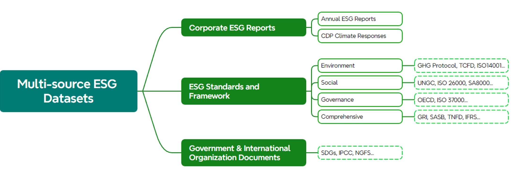
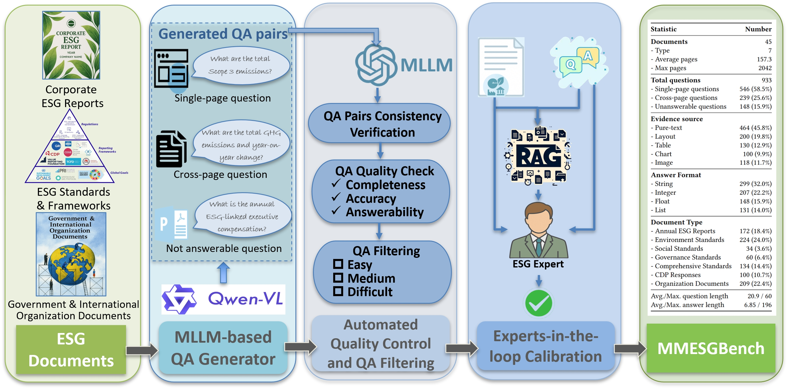

# MMESGBench: Benchmarking Multimodal Understanding and Complex Reasoning in ESG Documents

## 🌟 MMESGBench Highlights

- **First multimodal benchmark** tailored for multimodal document understaning and reasoning in ESG (Environmental, Social, and Governance) documents.
- Includes **933 high-quality QA pairs** covering single-page, cross-page, and unanswerable questions.
- Built from **45 long-form real-world ESG documents** from corporations, standards, and governments.
- Supports **multimodal evidence**: text, tables, charts, images, and layout-aware content.
- Constructed via a **human-AI collaborative pipeline**, combining LLM generation, model verification, and expert validation.

## 📁 Dataset

Our benchmark is organized in the `./dataset` directory, which includes both QA annotations and ESG source documents.

### 📝 Question Format

The questions are stored in JSON format with the following structure:

```json
{    
  "doc_id": "AR6 Synthesis Report Climate Change 2023.pdf",  
  "doc_type": "Government & International Organization Documents", 
  "question": "Using the IPCC report, calculate the total additional population exposed to coastal flooding events by 2040 under SSP2-4.5 scenario.",   
  "answer": "19.62",   
  "evidence_pages": "[116]",   
  "evidence_sources": "['Image', 'Generalized-text (Layout)']",   
  "answer_format": "Float"  
}
```

### 📄 Source Documents

All ESG documents used in MMESGBench are saved in ESG PDF files in '/dataset/ESG_source.pdf'. You can download all source documents from the **hyperlink** in the source table.

MMESGBench covers a **diverse set of ESG document sources**, organized into three primary categories:

1. **Corporate ESG Reports**  
   - Annual ESG Reports  
   - CDP Climate Responses

2. **ESG Standards and Frameworks**  
   - Environment (e.g., GHG Protocol, TCFD, ISO 14001)  
   - Social (e.g., UNGC, ISO 26000, SA8000)  
   - Governance (e.g., OECD, ISO 37000)  
   - Comprehensive (e.g., GRI, SASB, TNFD, IFRS)

3. **Government & International Organization Documents**  
   - e.g., SDGs, IPCC, NGFS

These categories reflect the full spectrum of real-world ESG disclosure contexts across industries and regulatory standards.



> *Figure: Taxonomy of ESG document sources used in MMESGBench.*

## 🛠️ Usage

### 🔧 Environment

All dependencies are listed in `requirements.txt`. You can install them with:

```bash
pip install -r requirements.txt
```

## 🚀 Running
To run the RAG pipeline, use:

```bash
python src/colpali.py
```

### 🤖 Supported Models

All supported models are organized under the `models/` directory. Each model has its own Python interface file and can be invoked via `llm.py` or `lvlm.py`.

The following models are currently supported:

- `chatglm` – ChatGLM LLM
- `deepseek_llm_7b_chat` – DeepSeek LLM (text-only)
- `deepseek_vl_chat` – DeepSeek-VL (vision-language model)
- `internlm_xc2_4khd` – InternLM-XC2-4KHD (multimodal)
- `internvl_chat` – InternVL-Chat (multimodal)
- `minicpm_llama3` – MiniCPM-LLaMA3-V2.5
- `mixtral_instruct` – Mistral/Mixtral Instruction-tuned model

> You can extend support for new models by adding a new script under `models/` and following the same interface pattern.

All models can be called using:

```bash
python src/llm.py
python src/lvlm.py
```

### 🧠 Model Generation Pipeline

MMESGBench is constructed via a **multi-stage human-AI collaborative pipeline** designed to generate high-quality, diverse, and semantically accurate QA pairs grounded in multimodal ESG documents.

- A **multimodal LLM** (e.g., Qwen-VL-Max) first generates candidate QA pairs from rendered document pages.
- An **LLM-based verifier** checks factual correctness, completeness, and reasoning complexity.
- **Human experts** review and calibrate each QA pair to ensure domain relevance and multimodal alignment.




> *Figure: The collaborative QA generation pipeline.*


