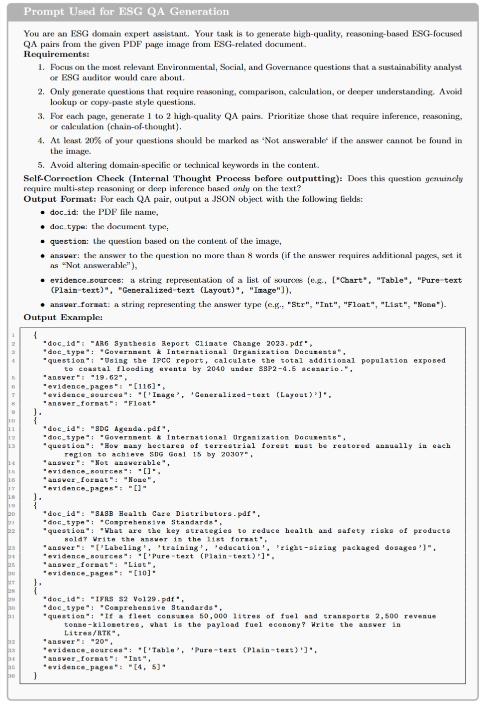
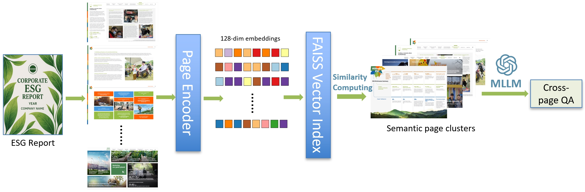
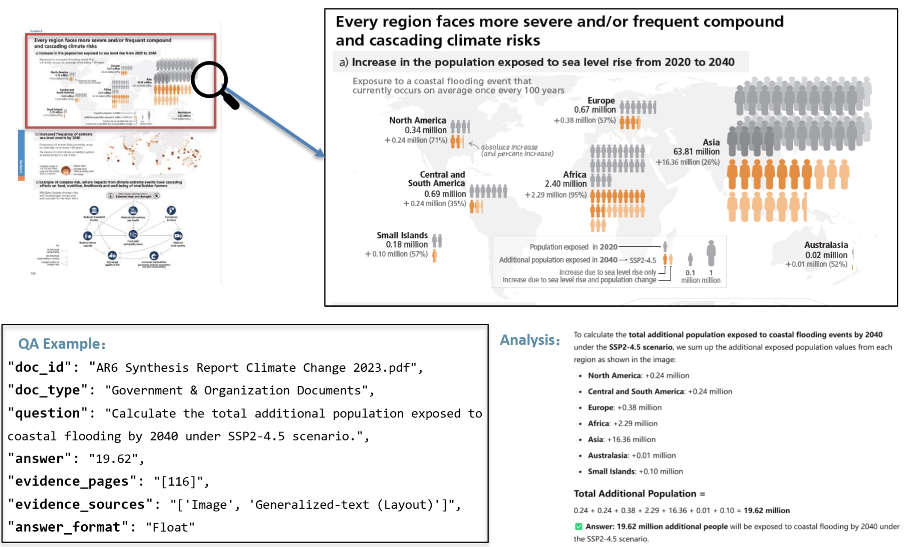
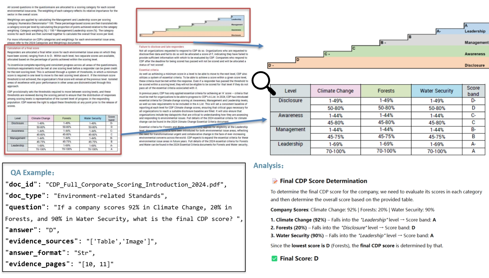
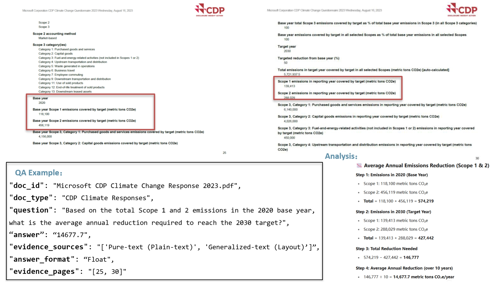
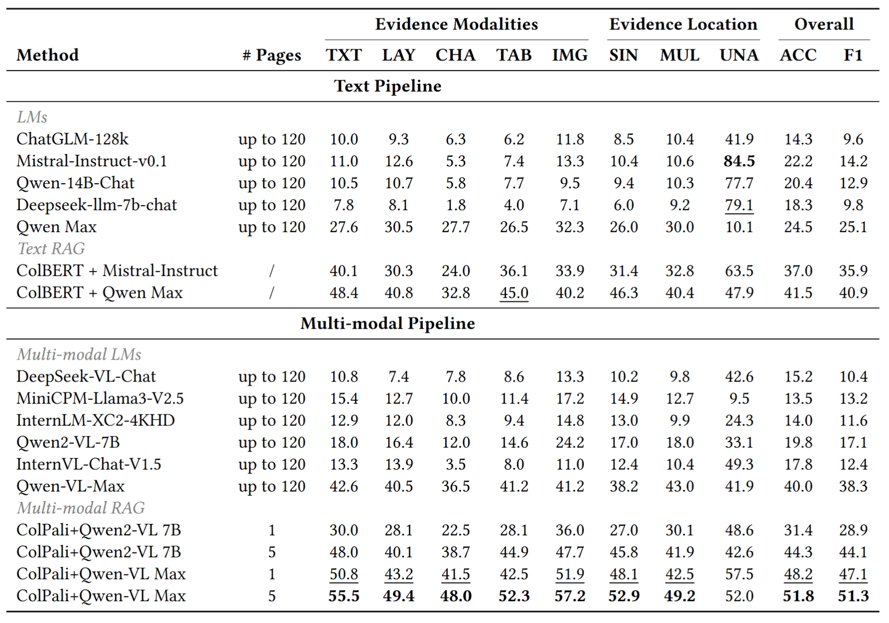

# MMESGBench: Benchmarking Multimodal Understanding and Complex Reasoning in ESG Documents

## 🌟 MMESGBench Highlights

- **First multimodal benchmark** tailored for multimodal document understaning and reasoning in ESG (Environmental, Social, and Governance) documents.
- Includes **933 high-quality QA pairs** covering single-page, cross-page, and unanswerable questions.
- Built from **45 long-form real-world ESG documents** from corporations, standards, and governments.
- Supports **multimodal evidence**: text, tables, charts, images, and layout-aware content.
- Constructed via a **human-AI collaborative pipeline**, combining LLM generation, model verification, and expert validation.

## 📁 Dataset

Our benchmark is organized in the `./dataset` directory, which includes both QA annotations and ESG source documents.

### 📝 Question Format

The questions are stored in JSON format with the following structure:

```json
{    
  "doc_id": "AR6 Synthesis Report Climate Change 2023.pdf",  
  "doc_type": "Government & International Organization Documents", 
  "question": "Using the IPCC report, calculate the total additional population exposed to coastal flooding events by 2040 under SSP2-4.5 scenario.",   
  "answer": "19.62",   
  "evidence_pages": "[116]",   
  "evidence_sources": "['Image', 'Generalized-text (Layout)']",   
  "answer_format": "Float"  
}
```

### 📄 Source Documents

All ESG documents used in MMESGBench are saved in ESG PDF files in '/dataset/ESG_source.pdf'. You can download all source documents from the **hyperlink** in the source table.

MMESGBench covers a **diverse set of ESG document sources**, organized into three primary categories:

1. **Corporate ESG Reports**  
   - Annual ESG Reports  
   - CDP Climate Responses

2. **ESG Standards and Frameworks**  
   - Environment (e.g., GHG Protocol, TCFD, ISO 14001)  
   - Social (e.g., UNGC, ISO 26000, SA8000)  
   - Governance (e.g., OECD, ISO 37000)  
   - Comprehensive (e.g., GRI, SASB, TNFD, IFRS)

3. **Government & International Organization Documents**  
   - e.g., SDGs, IPCC, NGFS

These categories reflect the full spectrum of real-world ESG disclosure contexts across industries and regulatory standards.


> *Figure: Taxonomy of ESG document sources used in MMESGBench.*

## 🛠️ Usage

### 🔧 Environment

All dependencies are listed in `requirements.txt`. You can install them with:

```bash
pip install -r requirements.txt
```

## 🚀 Running
To run the RAG pipeline, use:

```bash
python src/colpali.py
```

### 🤖 Supported Models

All supported models are organized under the `models/` directory. Each model has its own Python interface file and can be invoked via `llm.py` or `lvlm.py`.

The following models are currently supported:

- `chatglm` – ChatGLM LLM
- `deepseek_llm_7b_chat` – DeepSeek LLM (text-only)
- `deepseek_vl_chat` – DeepSeek-VL (vision-language model)
- `internlm_xc2_4khd` – InternLM-XC2-4KHD (multimodal)
- `internvl_chat` – InternVL-Chat (multimodal)
- `minicpm_llama3` – MiniCPM-LLaMA3-V2.5
- `mixtral_instruct` – Mistral/Mixtral Instruction-tuned model

> You can extend support for new models by adding a new script under `models/` and following the same interface pattern.

All models can be called using:

```bash
python src/llm.py
python src/lvlm.py
```

### 🧠 Model Generation Pipeline

MMESGBench is constructed via a **multi-stage human-AI collaborative pipeline** designed to generate high-quality, diverse, and semantically accurate QA pairs grounded in multimodal ESG documents.

- A **multimodal LLM** (e.g., Qwen-VL-Max) first generates candidate QA pairs from rendered document pages.
- An **LLM-based verifier** checks factual correctness, completeness, and reasoning complexity.
- **Human experts** review and calibrate each QA pair to ensure domain relevance and multimodal alignment.


> *Figure: The collaborative QA generation pipeline.*

### ✏️ Prompt & QA Generation Details

To ensure high-quality question-answer pairs grounded in real-world ESG documents, we design a task-specific **prompt template** that guides multimodal LLM to generate reasoning-based, diverse, and multimodal QA pairs. The prompt enforces domain fidelity, encourages multi-hop inference, and ensures a controlled rate of unanswerable cases.



> *Figure: ESG-specific prompt for QA pair generation.*

---

### 🔄 Cross-Page QA Generation Framework

For complex cross-page reasoning, we apply a **semantic clustering pipeline** to group related pages before prompting the model. A page encoder generates 128-dimensional embeddings, which are indexed using FAISS. Similarity-based grouping enables the model to reason across semantically connected but physically distant pages.



> *Figure: Detailed cross-page QA generation pipeline.*


### 🧪 QA Examples with Visual & Cross-Page Reasoning

MMESGBench includes challenging examples that require **multi-modal, cross-page, and numerical reasoning** over real-world ESG documents. Below are selected examples that showcase key capabilities tested by the benchmark.

---

#### 📊 Visual-based Numerical Reasoning

This example requires aggregating numerical evidence scattered across a **complex infographic**, combining layout and image features to compute a global population estimate.



> *Figure A3: Visual-based reasoning over charts and layout-aware image elements.*

---

#### 📈 Multi-page Tabular Score Reasoning

This question requires **multi-step score aggregation** across multiple pages, where tables encode logic for score assignment and minimum-score selection logic must be applied.



> *Figure A4: Table-based and cross-page QA requiring structured logic.*

---

#### 🧮 Cross-page Numerical Comparison & Arithmetic

A complex case involving **arithmetic calculation across time-series emissions data**, split across multiple pages and document sections.



> *Figure A5: Arithmetic and comparison reasoning from scoped ESG targets.*


### 📊 Benchmark Results

We evaluate a wide range of **text-only**, **multimodal**, and **retrieval-augmented** models on MMESGBench. Performance is reported across:

- **Evidence Modalities**: Text (TXT), Layout (LAY), Chart (CHA), Table (TAB), Image (IMG)
- **Evidence Location Types**: Single-page (SIN), Multi-page (MUL), Unanswerable (UNA)
- **Overall Performance**: Accuracy (ACC) and F1 score



> *Table 1: Evaluation of various models on MMESGBench. Best results in bold, second best underlined.*


